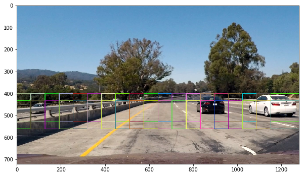

## Writeup / README

# Project 5: Vehicle Detection and Tracking
[](http://www.udacity.com/drive)

---
[//]: # (Image References)
[image1]: ./examples/car_not_car.png
[image2]: ./examples/HOG_example.jpg
[image3]: ./examples/sliding_windows.jpg
[image4]: ./examples/sliding_window.jpg
[image5]: ./examples/bboxes_and_heat.png
[image6]: ./examples/labels_map.png
[image7]: ./examples/output_bboxes.png
[video1]: ./project_video.mp4

## 1. introduction

The goals / steps of this project are the following:

* Perform a Histogram of Oriented Gradients (HOG) feature extraction on a labeled training set of images and train a classifier Linear SVM classifier
* Optionally, you can also apply a color transform and append binned color features, as well as histograms of color, to your HOG feature vector. 
* Note: for those first two steps don't forget to normalize your features and randomize a selection for training and testing.
* Implement a sliding-window technique and use your trained classifier to search for vehicles in images.
* Run your pipeline on a video stream (start with the test_video.mp4 and later implement on full project_video.mp4) and create a heat map of recurring detections frame by frame to reject outliers and follow detected vehicles.
* Estimate a bounding box for vehicles detected.

## 2. Relevant Files
The following list gives a short overview about all relevant files and its purpose.
* [vehicle_detection.ipynb](https://github.com/jkstyle2/CarND) includes all the steps for processing, training, detecting and tracking vehicles.
* [video_hog](https://) folder includes the video processed by HOG feature extraction.
* [video_hog+spatial](https://) folder includes the video processed by HOG and Spatially binning.
* [video_allfeatures(YCrCb)](https://) folder includes the video processed by HOG, Spatially binning and YCrCb color histogram.
* [video_allfeatures(YUV)](https://) folder includes the video processed by HOG, Spatially binning and YUV color histogram.

## 3. The Vehicle Classifier
The vehicle classifier classifies the object inside bounding boxes as "vehicle" or "non-vehicle". The linear support vector classifier was chosen from the scikit-learn library ([LinearSVC](http://scikit-learn.org/stable/modules/generated/sklearn.svm.LinearSVC.html)). Three feature extraction methods I learnt during the lesson were used: Spatially binning, Color channel histograms and Histogram of oriented Gradients(HOG). I'll explain these step by step.

### 3.1 Training data
To train the classifier, I used [KITTI](http://www.cvlibs.net/datasets/kitti/) and [GTI](http://www.gti.ssr.upm.es/data/Vehicle_database.html) dataset which are already labeled as "vehicle" and "non-vehicle". It consists of total 17760 samples and the two classes seem well balanced as shown in the table below.

| Class        | # of Samples | Percentage | Udacity Download Link                                                                         |
|:-------------|:--------|:-----------|:----------------------------------------------------------------------------------------------|
| Vehicles     | 8792    | 49,5 %     | [vehicles.zip](https://s3.amazonaws.com/udacity-sdc/Vehicle_Tracking/vehicles.zip)         |
| Non-Vehicles | 8968    | 50,5 %     | [non-vehicles.zip](https://s3.amazonaws.com/udacity-sdc/Vehicle_Tracking/non-vehicles.zip) |

The sample images from both classes are as below.


### 3.2 Spatially Binned Features
For the first feature, spatially binned raw color features from three separate channels were used. In the function `bin_spatial(image, size=(32, 32))`, images become resized to the determined size=(32,32), and then become concatenated to an 1D feature vector.

The pictures below show feature vectors extracted from different color spaces: RGB, HSV, LUV, HLS, YUV, YCrCb. The images are all scaled down from 64x64 to 32x32 pixels, and it results in the length of 32 * 32 * 3 = 3072. The difference between "vehicle" and a "non-vehicle" features is clearly visible.

NOTE)
One thing I learnt about differences between "binning" and "sub-sampling" is that binning deals with keeping the image the same size(i.e. the same dimensions as the original) while reducing the amount of colours which ultimately reduces the amount of space the image takes up. Subsampling reduces the image size by removing information all together. Usually when we subsample, we also interpolate or smooth the image so that we reduce aliasing. The goal is to take an image and reduce its dimensions so that we get a smaller image as a result.

**Class: "Vehicle"**


**Class: Non-Vehicle"**


#### Finding the best Hyper-parameters

To find out the best parameters of the spatially binning feature, I tested it with the following parameter sets.
- Color space : RGB, LUV, HLS, YUV, YCrCb
- Image size : (8x8), (16x16), (32x32)

The table below shows the results on the test dataset. One thing I was interested is that there seems to be no correlation between the image size and the accuracy(see 8x8 is higher than 16x16, but lower than 32x32). I find that the accuracy is more likely to depend on the color space. 
As a result, RGB, LUV, YUV, YCrCb color spaces with 32x32 image size were considered as the best scores (≥90).

| Color space | image size | Accuracy |
|:-------------------------|:------------------------|:------------------|
| RGB     | (8x8)        | 90.00 %     |
| RGB     | (16x16)    | 88.00 %     |
| RGB     | (32x32)    | 90.50 %     |
| LUV     | (8x8)         | 88.88 %     |
| LUV     | (16x16)     | 87.75 %     |
| LUV     | (32x32)     | 90.25 %     |
| HLS     | (8x8)         | 87.50 %     |
| HLS     | (16x16)     | 84.00 %     |
| HLS     | (32x32)     | 88.38 %     |
| YUV     | (8x8)         | 89.12 %     |
| YUV     | (16x16)     | 89.00 %     |
| YUV     | (32x32)     | 90.00 %     |
| YCrCb  | (8x8)         | 88.25 %     |
| YCrCb  | (16x16)     | 88.50 %     |
| YCrCb  | (32x32)     | 90.00 %     |


### 3.3 Color Histogram Features
For the second feature, color histogram of three color channels are used. The function `color_hist(image, nbins=32, bins_range=(0,256))` takes an image, splits it into three different channels, and finally calculates the histogram of each channel separately. All the features are then concatenated to an 1D feature vector as the spatially binned feature was done.

The diagrams below show a result of the features for the class "vehicle" and "non-vehicle". The histograms with a bin size of 32 for red, green and blue color channels were calculated and it leads to a length of 32 bin * 3 channels = 96. On the right side, the concatenated 1D feature vector is depicted.

**Class: "Vehicle"**


**Class: Non-Vehicle"**


#### Finding the best Hyper-parameters

To find out the best parameters of the color histogram feature, I tested it with the following parameter sets.
- Color space : RGB, LUV, HLS, YUV, YCrCb
- # of bins : 8, 16, 32, 64

The table below shows the results on the test dataset. With the result, I cannot assure that there is a strong correlation between the number of bins and accuracy, but it seems to be high with color space.
As a result, LUV with 32bins, HLS with 64bins, YCrCb with 64 bins were considered as the best scores (≥91).

| Color space | # of bins | Accuracy |
|:-------------------------|:------------------------|:------------------|
| RGB     | 8        | 81.38 %     |
| RGB     | 16    | 77.50 %     |
| RGB     | 32    | 86.00 %     |
| RGB     | 64    | 87.12 %     |
| LUV     | 8         | 91.50 %     |
| LUV     | 16     | 90.62 %     |
| LUV     | 32     | 92.12 %     |
| LUV     | 64     | 90.38 %     |
| HLS     | 8         | 87.00 %     |
| HLS     | 16     | 89.25 %     |
| HLS     | 32     | 91.00 %     |
| HLS     | 64     | 93.12 %     |
| YUV     | 8         | 88.75 %     |
| YUV     | 16     | 85.75 %     |
| YUV     | 32     | 87.88 %     |
| YUV     | 64     |  89.38%     |
| YCrCb  | 8         | 87.88 %     |
| YCrCb  | 16     | 87.38 %     |
| YCrCb  | 32     | 86.75 %     |
| YCrCb  | 64     | 91.25 %     |


### 3.4 Histogram of Oriented Gradients (HOG) Features

For the last feature, the histogram of oriented gradients (HOG) from three separate channels were used. The function ` get_hog_features(image, orient, pix_per_cell, cell_per_block, vis=False, feature_vec=True)`  first takes an image and calculates the HOG features for the specified color channel, then returns a 1D feature vector. The total length of the HOG feature vector can be calculated with following: 
- # of block positions = (64pixels / 8cells_per_block - 1)^2 = 49
- # of cells per block = 2 * 2 = 4
- # of orientations = 9
- => Total length of a single channel = 49 * 4 * 9 = 1764
- => Total length of all channels = 1764 * 3 = 5292

I haven't got a chance yet to look through the paper, [Histograms of Oriented Gradients for Human Detection, Navneet Dalal and Bill Triggs](http://lear.inrialpes.fr/people/triggs/pubs/Dalal-cvpr05.pdf), but later when I get time, I would like to read it through.

The charts below show a result of the features for the class "vehicle" and "non-vehicle". YCrCb image is taken in the top row, followed by the Y, Cr and Cb channels. The second row shows the corresponding HOG Images with orientations and the last row depicts the concatenated 1D feature vectors. 

**Class: "Vehicle"**


**Class: Non-Vehicle"**


#### Finding the best Hyper-parameters
As it appeared above, the size of the feature vector from HOG is quite huge, which highly affects the computing time, so that the parameters should be chosen very carefully.
For this reason, I limited the number of orientations to 8, the number of pixels per cell to 8, the number of cells per blocks to 2, which actually led to a suitable result.
To find out the best result with the conditions, I tested it with several parameter sets as below:

- Color space : RGB, LUV, HLS, YUV, YCrCb
- Color channels : ALL, ch0, ch1, ch2

The top accuracies have been achieved with HLS, YUV and YCrCb with all color channels as below.

| Color space | # of channels | Accuracy |
|:-------------------------|:------------------------|:------------------|
| RGB     | 0        | 91.00 %     |
| RGB     | 1    | 92.88 %     |
| RGB     | 2    | 94.50 %     |
| RGB     | ALL    | 94.25 %     |
| LUV     | 0        | 92.25 %     |
| LUV     | 1    | 88.00 %     |
| LUV     | 2    | 85.25 %     |
| LUV     | ALL    | 96.12 %     |
| HLS     | 0        | 86.88 %     |
| HLS     | 1    | 92.38 %     |
| HLS     | 2    | 85.25 %     |
| HLS     | ALL    | 97.00 %     |
| YUV     | 0        | 92.88 %     |
| YUV     | 1    | 91.50 %     |
| YUV     | 2    | 86.88 %     |
| YUV     | ALL    | 97.50 %     |
| YCrCb     | 0        | 92.75 %     |
| YCrCb     | 1    | 88.50 %     |
| YCrCb     | 2    | 87.62 %     |
| YCrCb     | ALL    | 98.00 %     |


### 3.5 Combination of Feature Sets
After extracting each feature from functions `bin_spatial()` , `color_hist()` ` get_hog_features()` ,  all the features were combined and again fine tuned with the relevant hyper-parameters in order to find an optimum point between the accuracy and the computing time.
Although the parameter setup in the YCrCb with 16 orientations of HOG achieved the best accuracy of 99.5%, its computing time was almost 4 times higher than the second best results of 99.25%.
As a result, YCrCb with (32,32) spatial size, 64 bins and 10 orientations was chosen as the final parameter set.

| Color space | Spatial size | # of bins | # of orientations | Accuracy |
|:-------------------------|:------------------------|:------------------|:------------------|:------------------|
| RGB     | 32x32        | 64     | 10    | 96.62 %     |
| LUV     | 32x32        | 64     | 10    | 98.12 %     |
| LUV     | 32x32        | 32     | 10    | 98.38 %     |
| HLS     | 32x32        | 64     | 10    | 97.88 %     |
| YUV     | 32x32        | 64     | 10    | 98.75 %     |
| YCrCb     | 32x32        | 64     | 8    | 99.12 %     |
| YCrCb     | 32x32        | 64     | 10    | 99.25 %     |
| YCrCb     | 32x32        | 64     | 16    | 99.50 %     |
| YCrCb     | 32x32        | 128     | 8    | 99.00 %     |
| YCrCb     | 16x16        | 64     | 8    | 98.38 %     |

**Final Hyper-Parameters**
```python
    spatial_size = (32, 32)       # size of spatially binned image
    hist_nb_bins = 64              # the number of histogram bins
    hog_orient = 10                 # the number of HOG orientations
    hog_pix_per_cell = 8          # the number of pixels per cell
    hog_cell_per_block = 2       # the number of cells per block
    hog_channel = 'ALL'           # the number of HOG channels
```


## 4. HOG Sub-Sampling Method
At the beginning, I tried the simple basic sliding window approach which actually turned out to be extremely slow, especially when multi-scaled windows were applied. Therefore, I adapted the "HOG sub-sampling method", which can reduce a large amount of computing time with an efficient way. The idea of this method is that rather than performing feature extraction on each window individually, which is very time consuming, the HOG features are extracted for the entire(or cropped ROI) image first, and these full-image features are subsampled according to the size of the window, and then finally fed into the classifier. The ROI is defined by y range `y_start` , `y_stop` , and the scaling factor `scale`. Afterwards, the subsampled images are used to calculate the other feature sets like spatial binning and color histogram.
The image below shows each step for the HOG sub-sampling method.


### 4.1 Process of the Full Pipeline (???)


## 5. Sliding Window Search
To configure sliding window search, I explored several parameters such as window sizes and positions with various overlaps in the X and Y directions. The following five images describe the implementation of all search windows with various `scales`: small(x1, x1.5), medium(x2, x2.5), and large(x3) windows
When I implemented it with 0.5 scales, it returned too many false positives, so it wasn't applied.
Furthermore, the `overlap` of 50% in both X and Y directions was not enough to produce more redundant true positive detections, I changed the overlap in Y direction to 75% while keeping 50% in X direction.

**1) Scale=1**

**1) Scale=1.5**

**1) Scale=2**

**1) Scale=2.5**

**1) Scale=3**


The image below shows the rectangles returned by `find_cars` applied onto one of the test images in the final implementation. Notice that there are several positive predictions on each of the cars, but also found a false positive prediction on near a guard rail.


## 6. Heat map
Next, heat map method was used to integrate multiple overlapping positive rectangles into a unified detection as well as reject the false positive detections. A true positive is typically acquired by several positive detections, while a false positive is acquired by only one or two detections, so that thresholding is applied to differentiate between the two. The function `add_geat` increase all pixels value within the window, making them "hot(+=1)". The more overlapping rectangles are, the higher level of heat is assigned. The following image is the resulting heatmap from the image above.


Then, a threshold value = 1 was applied to the heatmap, setting all pixels which don't exceed the threshold to zero, as below.


As next step, the bounding boxes can be identified by analyzing the thresholded heatmap using [`scipy.ndimage.measurements.label()`](https://docs.scipy.org/doc/scipy-0.16.0/reference/generated/scipy.ndimage.measurements.label.html) method. It returns a labeled array indicating regions belonging together.


And the final detection area is set to each identified label as below.


## 7. Implementation on Test images
Using the final pipeline above, the objects in all the test images were identified without any exception.

When I first implemented it on the test images, it did not perform very well in some images, failing to identify the near-field vehicles. Then, I tried fine-tuning again, changing pix_per_cell to 16 from 8, orient to 12 from 10 with overlapping degree and heatmap threshold too. Eventually I could detect all in the test images, but it obviously sacrified the computing time.


---

## 8. Video Implementation

### 8-1. Provide a link to your final video output.  Your pipeline should perform reasonably well on the entire project video (somewhat wobbly or unstable bounding boxes are ok as long as you are identifying the vehicles most of the time with minimal false positives.)
Here's a [link to my video result](./video_results)
There are 4 processed output videos, and the `video_allfeatures(YCrCb)` has got the best result. I'm willing to develeop it better after this submission.

### 8-2. Describe how (and identify where in your code) you implemented some kind of filter for false positives and some method for combining overlapping bounding boxes.
The code for processing video is in the last cells, and is almost same as the code for processing a single image descibed above. The only difference is that storing the detections from the previous 15 frames of video using the `prev_rects` parameters from `Vehicle_Detect` class is added. The detections for the previous 15 frames are combined to the heatmap and the threshold for the heatmap is set to `1 + len(det.prev_rects)//2` (one more than the half number of rectangles contained in the history). It was just empirically considered reasonable rather than using a single scalar or the full number of rectangle sets in the history.

---

## 9. Discussion

### 1. Briefly discuss any problems / issues you faced in your implementation of this project.  Where will your pipeline likely fail?  What could you do to make it more robust?

Here I'll talk about the approach I took, what techniques I used, what worked and why, where the pipeline might fail and how I might improve it if I were going to pursue this project further.  

This project deals with a kind of old fashioned methods. However, it was valuable enough to go through all the processing steps such as HOG, Spatial binning, Color histogram, Heatmap, etc. It has helped me to better understand and judge the pros and cons of newer or alternatives concepts.
Moreover, It was also clear to get to know about how difficult and time consuming it is regarding parameter tuning manually.

The pipeline seems working well on the project video, but it is actually quite far away from being used in real world system. It has difficulty to distinguish two different vehicles when they are located too close. In that case, the bounding boxes are merged together, which is undesirable for real-world system. I guess that possible solution would be to classify the color of each vehicle clearly or tracking its position from the previous detection information, considering its relative speeds, direction, and the occupied lane area. It would be possible using kalman filter series to estimate the object's movements.
What's more, it seems to be most likely to fail in cases where vehicles have different appearance from those in training dataset, as well as the lighting and other environmental conditions might play a role. The collection of data as much as possible would be an essential task to get to higher accuracy.


